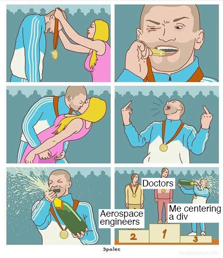

class: slide-fullscreen-content, slide-ruda
background-image: url(../images/general/Primary.png)

# Webowe Pogawędki #5

---

# Firefox `v76`

<div style="height: 300px"></div>

* <https://www.mozilla.org/en-US/firefox/76.0/releasenotes/?v=b>

---

# Inkscape `v1.0`

<div style="height: 300px"></div>

* <https://wiki.inkscape.org/wiki/index.php?title=Release_notes/1.0#Inkscape_1.0>

---

# `GitHub` rozbija bank 🔥

<div style="height: 250px"></div>

* <https://github.com/cli/cli>
* <https://github.blog/2020-05-06-new-from-satellite-2020-github-codespaces-github-discussions-securing-code-in-private-repositories-and-more/>

---

# `Microsoft` rozbija bank! 🔥

## .size35[Miliard dolarów na transformację cyfrową w Polsce od Microsoft]

<div style="height: 250px"></div>

* <https://antyweb.pl/polska-dolina-cyfrowa-z-miliardem-dolarow-od-microsoft/>

---

# Tool 🛠 Web Vitals

<div style="height: 250px"></div>

* <https://github.com/GoogleChrome/web-vitals/>
* <https://blog.chromium.org/2020/05/introducing-web-vitals-essential-metrics.html>

---

# Tool 🛠 Vite

<div style="height: 250px"></div>

* <https://github.com/vuejs/vite>

---

# Deno in 100 seconds

## `Live Demo` ⚡️

<div style="height: 200px"></div>

* <https://www.youtube.com/watch?v=F0G9lZ7gecE>

---

# .size70[Tips 💡 Fajne one-linery JavaScript]

## Wszystko w jednym miejscu

<div style="height: 200px"></div>

* <https://1loc.dev/>

---

# Tips 💡 Reduce + Spread = 💩

.size40[

```js
let result = items.reduce((acc, item) => ({

   ...acc, [item.name]: item.value

}), {})
```

]

* <https://www.richsnapp.com/article/2019/06-09-reduce-spread-anti-pattern>

---

# Let's talk! 🗣

<div style="height: 250px"></div>

.color-white[

## Kontrybucje

# .slim[Open Source]

]

---

class: color-white
background-image: url(../images/general/Plain-Vertical.png)

# Make my day 😂



---

class: slide-fullscreen-content, slide-ruda
background-image: url(../images/general/Primary.png)

# Thanks
