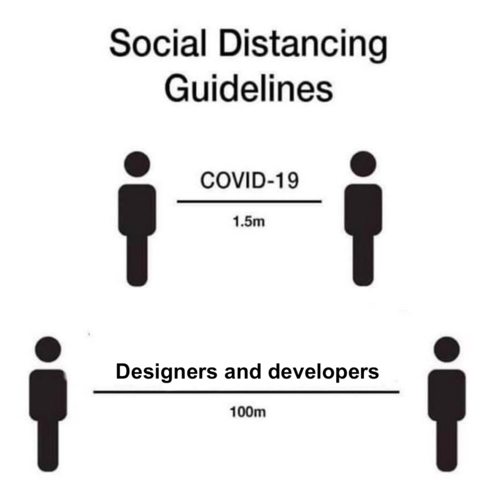

class: slide-fullscreen-content, slide-ruda
background-image: url(../images/general/Primary.png)

# Webowe Pogawędki #6

---

class: master-center

<video src="./videos/podcast.mp4" controls autoplay loop></video>

---

# ESLint v7.0.0

* <https://eslint.org/blog/2020/05/eslint-v7.0.0-released>

---

# News 2

---

# Szybsze prototypy CSS 🛠

* <https://tachyons.io/>

---

# Tool 🛠 2

---

# Zbiór porad Next.js 💡
* <https://nextjstips.com/>

---

# Tips 💡 2

---

# Let's talk! 🗣

* [Rządowe aplikacje i Open Source](https://informatykzakladowy.pl/znamy-tresc-umowy-na-wykonanie-aplikacji-kwarantanna-domowa-czy-rzad-przeplacil/)
---

class: color-white
background-image: url(../images/general/Plain-Vertical.png)

# Make my day 😂

---

class: slide-fullscreen-content, slide-ruda
background-image: url(../images/general/Primary.png)

# Thanks
