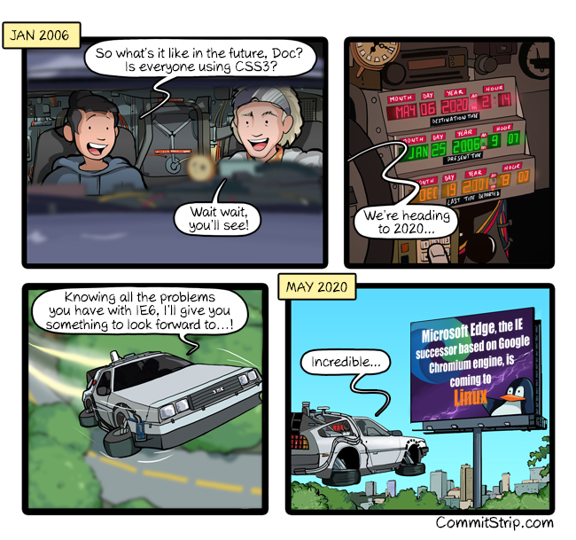

class: slide-fullscreen-content, slide-ruda
background-image: url(../images/general/Primary.png)

# Webowe Pogawędki #7

---

class: master-center

<video src="../videos/podcast.mp4" controls autoplay loop></video>

---

# React Native dla macOS

* <https://microsoft.github.io/react-native-windows/blog/2020/05/19/rn4mupdadates>

---

# Łatwe i przyjemne Animacje CSS 🛠

<div style="height: 250px"></div>

* <https://animista.net/play/attention/shake>

---

# Mock Interfaces, Not Internals 💡

* <https://www.leighhalliday.com/mock-fetch-jest>

```javascript
import React from "react";
import { render } from "@testing-library/react";
import App from "./App";

jest.mock("./utils/currency", () => {
  return {
    convert: jest.fn().mockImplementation(() => {
      return 1.42;
    }),
  };
});

test("renders learn react link", async () => {
  const { findByText } = render(<App />);
  const element = await findByText(/USD to CAD: 1.42/i);
  expect(element).toBeInTheDocument();
});
```

---

# Let's talk! 🗣

<div style="height: 250px"></div>

* ...

---

class: color-white
background-image: url(../images/general/Plain-Vertical.png)

# Make my day 😂



---

class: middle, slide-invert-colors
background-image: none


## `Morning Sunshine New Progression`

#### MYSEN

<div style="width: 470px; margin: 50px 0;"><hr/></div>

Wykonawca: MYSEN

---

class: slide-fullscreen-content, slide-ruda
background-image: url(../images/general/Primary.png)

# Thanks
