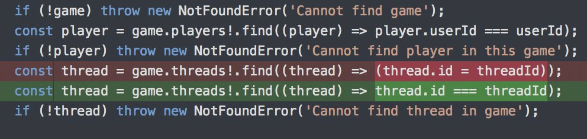

class: slide-fullscreen-content
background-image: url(images/webowe-pogawedki/Intro.png)

---

# Dekoratory w <span class="slim">JavaScript</span>

<div style="height: 300px"></div>

<https://github.com/piecioshka/test-decorators>

---

# Narzędzie do testów

<div style="height: 300px"></div>

<https://webhook.site>

---

# <del>Deno Community <span class="slim">umiera!</span></del>


---

## Jak usunąć właściwość w obiekcie?

.size25[

```js
const car = {
    price: '300',
    color: 'purple'
};
delete car.price;
console.log(car); // {color: "purple"}
```

]

.size25[

```js
const { price, ...carWithoutPrice } = car;
console.log(carWithoutPrice); // {color: "purple"}
```

]

Źródło: <https://twitter.com/housecor/status/1243562849311563777>

---

# Dyskusja

<div style="height: 250px"></div>

* Kto używa <a href="https://prettier.io/">Prettiera</a> i jak?
* Przykład na projekcie z Git `pre-commit`
    + <https://github.com/piecioshka/test-prettier>

---

# Make my day 😂

Jak można się pomylić:



Źródło: <https://twitter.com/jaffathecake/status/1243219575845597184>

---

class: slide-fullscreen-content
background-image: url(images/webowe-pogawedki/Outro.png)
